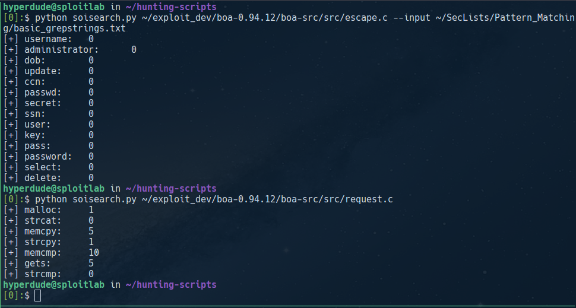

# Bug Hunting Helper Scripts
Just a few basic scripts I've written as I get started doing bug hunting/appsec research. These are very basic but should be easy to extend. They've been written to be as generic as possible. Go crazy.

## soisearch
__Search for strings of interest (soi!) in a file.__
### Usage
```
usage: soisearch.py [-h] [--input INPUT_FILE] [--output OUTPUT_FILE] TARGET

Search a file against a list of strings for strings of interest.

positional arguments:
  TARGET                target file to search against (if a directory, search all regular files in top level)

optional arguments:
  -h, --help            show this help message and exit
  --input INPUT_FILE    input file of search strings
  --output OUTPUT_FILE  output file to save results to
```

<p align="center">
  
</p>
